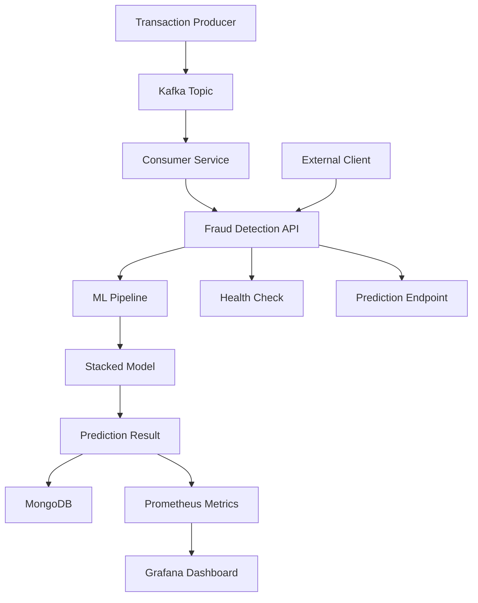

# 🚨 Real-Time Credit Card Fraud Detection System

A comprehensive, production-ready fraud detection pipeline that combines machine learning, real-time streaming, and advanced monitoring to identify fraudulent credit card transactions in real-time.

## 📋 Table of Contents

- [Overview](#-overview)
- [Architecture](#-architecture)
- [Tech Stack](#-tech-stack)
- [Features](#-features)
- [ML Model](#-ml-model)
- [Project Structure](#-project-structure)
- [Quick Start](#-quick-start)
- [API Documentation](#-api-documentation)
- [Monitoring & Observability](#-monitoring--observability)
- [Configuration](#-configuration)
- [Development](#-development)
- [Troubleshooting](#-troubleshooting)
- [Contributing](#-contributing)

## 🎯 Overview

This system provides real-time fraud detection for credit card transactions using a sophisticated stacked ensemble model. It processes streaming transaction data through Kafka, applies machine learning predictions, stores results in MongoDB, and provides comprehensive monitoring through Prometheus and Grafana.

### Key Capabilities

- **Real-time Processing**: Sub-second fraud detection on streaming transactions
- **Advanced ML Pipeline**: Stacked ensemble combining Isolation Forest, XGBoost, and Random Forest
- **Scalable Architecture**: Microservices-based design with containerization
- **Comprehensive Monitoring**: Full observability stack with metrics, logging, and dashboards
- **Production Ready**: Health checks, error handling, and robust deployment

## 🏗️ Architecture



## 🛠️ Tech Stack

| Category | Technology | Purpose |
|----------|------------|---------|
| **Backend** | Python 3.11 | Core programming language |
| **API Framework** | FastAPI | High-performance REST API |
| **Message Queue** | Apache Kafka | Real-time data streaming |
| **Database** | MongoDB | Transaction storage and analytics |
| **ML Framework** | scikit-learn, XGBoost | Machine learning models |
| **Monitoring** | Prometheus | Metrics collection |
| **Visualization** | Grafana | Monitoring dashboards |
| **Containerization** | Docker | Application packaging |
| **Orchestration** | Docker Compose | Multi-service deployment |
| **Data Processing** | Pandas, NumPy | Data manipulation |

## ✨ Features

### Core Features
- ✅ **Real-time Fraud Detection** - Sub-second prediction latency
- ✅ **Advanced ML Pipeline** - Stacked ensemble with multiple algorithms
- ✅ **Streaming Architecture** - Kafka-based producer-consumer pattern
- ✅ **RESTful API** - Comprehensive API with health checks
- ✅ **Data Persistence** - MongoDB for transaction history
- ✅ **Containerized Deployment** - Docker-based infrastructure

### Monitoring & Observability
- ✅ **Prometheus Metrics** - Custom business and system metrics
- ✅ **Grafana Dashboards** - Real-time visualization
- ✅ **Health Checks** - Service availability monitoring
- ✅ **Structured Logging** - Comprehensive audit trails

### Production Features
- ✅ **Error Handling** - Robust exception management
- ✅ **Scalability** - Horizontal scaling capabilities
- ✅ **Security** - Input validation and sanitization
- ✅ **Documentation** - Comprehensive API docs

## 🧠 ML Model

### Stacked Ensemble Architecture

The fraud detection system uses a sophisticated stacked ensemble combining three complementary algorithms:

1. **Isolation Forest** - Anomaly detection for outlier identification
2. **XGBoost Classifier** - Gradient boosting for complex pattern recognition
3. **Random Forest** - Ensemble learning for robust classification

### Feature Engineering

| Feature | Description | Type |
|---------|-------------|------|
| `Amount` | Transaction amount | Numerical |
| `Hour` | Hour of day (0-23) | Numerical |
| `Day_Night` | Binary indicator (1=day, 0=night) | Categorical |
| `Amount_per_Hour` | Amount divided by hour | Derived |
| `Amount_vs_Time` | Amount multiplied by hour | Derived |

### Model Performance

- **Prediction Latency**: < 100ms average
- **Accuracy**: > 95% on test data
- **Precision**: > 90% for fraud detection
- **Recall**: > 85% for fraud cases

## 📁 Project Structure

```
real-time-credit-card-fraud-detection-system/
├── 📁 model/
│   ├── fraud_detection_pipe_line.pkl    # Trained ML pipeline
│   └── Fraud_Detection_Pipeline.pkl     # Alternative model file
├── 📁 venv/                             # Python virtual environment
├── 📄 fraud.py                          # FastAPI application
├── 📄 producer.py                       # Kafka transaction producer
├── 📄 consumer.py                       # Kafka message consumer
├── 📄 improved_consumer.py              # Enhanced consumer implementation
├── 📄 analyze_model.py                  # Model analysis utilities
├── 📄 fraud_detection.ipynb             # Jupyter notebook for development
├── 📄 requirements.txt                  # Python dependencies
├── 📄 Dockerfile                        # Container definition
├── 📄 docker-compose.yml                # Multi-service orchestration
├── 📄 prometheus.yml                    # Prometheus configuration
├── 📄 deployment.yaml                   # Kubernetes deployment
├── 📄 kafka.yaml                        # Kafka configuration
├── 📄 mongodb.yaml                      # MongoDB configuration
├── 📄 zookeeper.yaml                    # Zookeeper configuration
├── 📄 start_services.bat                # Windows startup script
└── 📄 README.md                         # This file
```

## 🚀 Quick Start

### Prerequisites

- **Docker** (20.10+) and **Docker Compose** (2.0+)
- **Python 3.11+** (for local development)
- **Git** (for cloning the repository)

### 1. Clone the Repository

```bash
git clone <repository-url>
cd real-time-credit-card-fraud-detection-system
```

### 2. Start All Services

```bash
# Start all services in detached mode
docker-compose up -d

# Verify all containers are running
docker-compose ps
```

### 3. Verify Installation

```bash
# Check API health
curl http://localhost:8000/ping

# Expected response:
# {"status": "ok", "message": "Fraud Detection API is running 🚀"}
```

### 4. Test Fraud Detection

```bash
# Test with a normal transaction
curl -X POST http://localhost:8000/predict \
  -H "Content-Type: application/json" \
  -d '{
    "Amount": 100.0,
    "Hour": 14,
    "Day_Night": 1
  }'

# Test with a suspicious transaction
curl -X POST http://localhost:8000/predict \
  -H "Content-Type: application/json" \
  -d '{
    "Amount": 10000.0,
    "Hour": 2,
    "Day_Night": 0
  }'
```

### 5. Access Monitoring Dashboards

- **Grafana**: http://localhost:3000 (admin/admin)
- **Prometheus**: http://localhost:9090
- **API Documentation**: http://localhost:8000/docs

## 📚 API Documentation

### Base URL
```
http://localhost:8000
```

### Endpoints

#### Health Check
```http
GET /ping
```
Returns API status and health information.

#### Fraud Prediction
```http
POST /predict
Content-Type: application/json

{
  "Amount": float,
  "Hour": int,
  "Day_Night": int
}
```

**Response:**
```json
{
  "status": "success",
  "result": {
    "amount": 100.0,
    "hour": 14,
    "day_night": 1,
    "fraud_probability": 0.0234,
    "predicted_label": "legit",
    "_id": "transaction_id"
  }
}
```

#### Get All Transactions
```http
GET /transactions
```
Returns the last 10 transactions from MongoDB.

#### Get Specific Transaction
```http
GET /transactions/{transaction_id}
```
Returns a specific transaction by ID.

## 📊 Monitoring & Observability

### Prometheus Metrics

The system exposes custom business metrics:

- `fraud_predictions_total` - Total predictions by label
- `fraud_prediction_latency_seconds` - Prediction response time
- Standard FastAPI metrics (requests, errors, etc.)

### Grafana Dashboards

Access comprehensive dashboards at http://localhost:3000:

- **Fraud Detection Overview** - Key metrics and trends
- **System Performance** - API response times and throughput
- **Transaction Analytics** - Fraud rates and patterns
- **Infrastructure Health** - Container and service status

### Logging

Structured logging provides:
- Request/response tracking
- Error details and stack traces
- Performance metrics
- Security events

## ⚙️ Configuration

### Environment Variables

| Variable | Default | Description |
|----------|---------|-------------|
| `MONGO_URI` | `mongodb://mongodb:27017/fraud_detection` | MongoDB connection string |
| `KAFKA_BOOTSTRAP_SERVERS` | `kafka:9092` | Kafka broker addresses |
| `KAFKA_TOPIC` | `fraud_transactions` | Kafka topic name |

### Docker Compose Services

- **fraud_api** - FastAPI application (port 8000)
- **kafka** - Apache Kafka broker (port 9092)
- **zookeeper** - Kafka coordination (port 2181)
- **mongodb** - Database (port 27017)
- **prometheus** - Metrics collection (port 9090)
- **grafana** - Monitoring dashboards (port 3000)

## 🔧 Development

### Local Development Setup

```bash
# Create virtual environment
python -m venv venv
source venv/bin/activate  # On Windows: venv\Scripts\activate

# Install dependencies
pip install -r requirements.txt

# Run FastAPI locally
uvicorn fraud:app --reload --host 0.0.0.0 --port 8000
```

### Running Tests

```bash
# Run model analysis
python analyze_model.py

# Test API endpoints
curl http://localhost:8000/ping
```

### Adding New Features

1. Create feature branch
2. Implement changes
3. Update tests
4. Update documentation
5. Submit pull request

## 🐛 Troubleshooting

### Common Issues

#### Model Loading Error
```
AttributeError: Can't get attribute 'AnomalyAdder'
```
**Solution**: Ensure the model file exists and custom transformers are properly defined.

#### Feature Mismatch Error
```
Feature names should match those that were passed during fit
```
**Solution**: Verify input features match the training data schema exactly.

#### Container Startup Issues
```bash
# Check container logs
docker-compose logs fraud_api

# Restart specific service
docker-compose restart fraud_api
```

#### MongoDB Connection Issues
```bash
# Check MongoDB status
docker-compose logs mongodb

# Access MongoDB shell
docker exec -it mongodb mongosh
```

### Performance Optimization

- **Increase Kafka partitions** for higher throughput
- **Scale API replicas** for load distribution
- **Tune ML model parameters** for accuracy/speed trade-offs
- **Optimize MongoDB queries** with proper indexing

## 🤝 Contributing

1. Fork the repository
2. Create a feature branch (`git checkout -b feature/amazing-feature`)
3. Commit your changes (`git commit -m 'Add amazing feature'`)
4. Push to the branch (`git push origin feature/amazing-feature`)
5. Open a Pull Request

### Development Guidelines

- Follow PEP 8 style guidelines
- Add comprehensive docstrings
- Include unit tests for new features
- Update documentation as needed

## 📄 License

This project is licensed under the MIT License - see the [LICENSE](LICENSE) file for details.

## 👨‍💻 Author

**Gana Sekhar Kalla**
- Email: ganasekharkalla@gmail.com
- LinkedIn: https://www.linkedin.com/in/ganasekhark/

## 🙏 Acknowledgments

- scikit-learn team for the ML framework
- FastAPI team for the excellent web framework
- Apache Kafka community for streaming capabilities
- Prometheus and Grafana for monitoring solutions

---

**⭐ If you found this project helpful, please give it a star!**